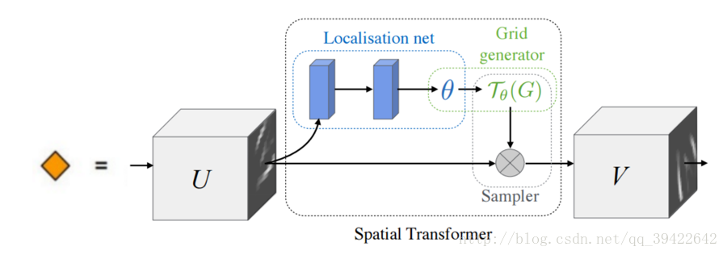

# STN_in_pytorch
spatial transform network implement in pytorch

### 简介

CNN是一个很强大的模型类，但是仍会受限于输入数据的空间不变性，也就是不可避免会碰到形变、平移、旋转等问题，我们通常是人工在训练开始前做好这些变化。空间变换网络（STN）是为了让网络能够自行学习上述变化，而不需要人工干预。所谓STN就是包含了 一个 空间变换层Spatial Transformer Layer（STL）的网络

### 结构

一个STL的结构如上图，包括：

* 定位网络Localisation net， 可以是全连接网络，也可以是卷积网络，但是最后一定要有回归层，具体看代码。参数矩阵初始化一般为恒等矩阵，权重一般1e-3 ~1e-5
* 坐标映射：Grid generator 

* 像素的采集：Sampler

更多知识可以看 仓库中的 stn详解.pdf